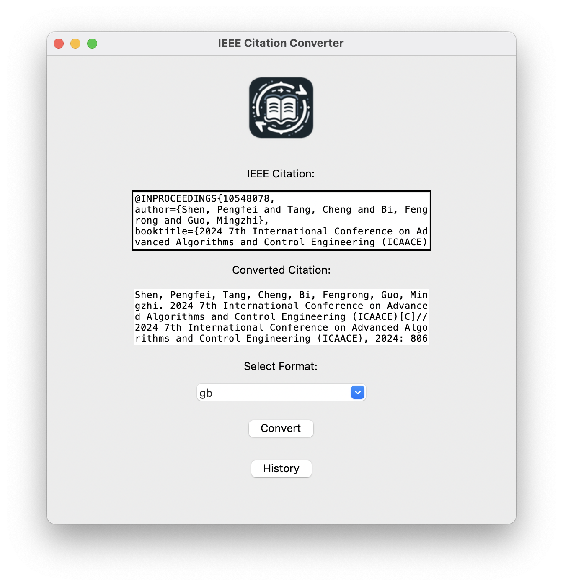
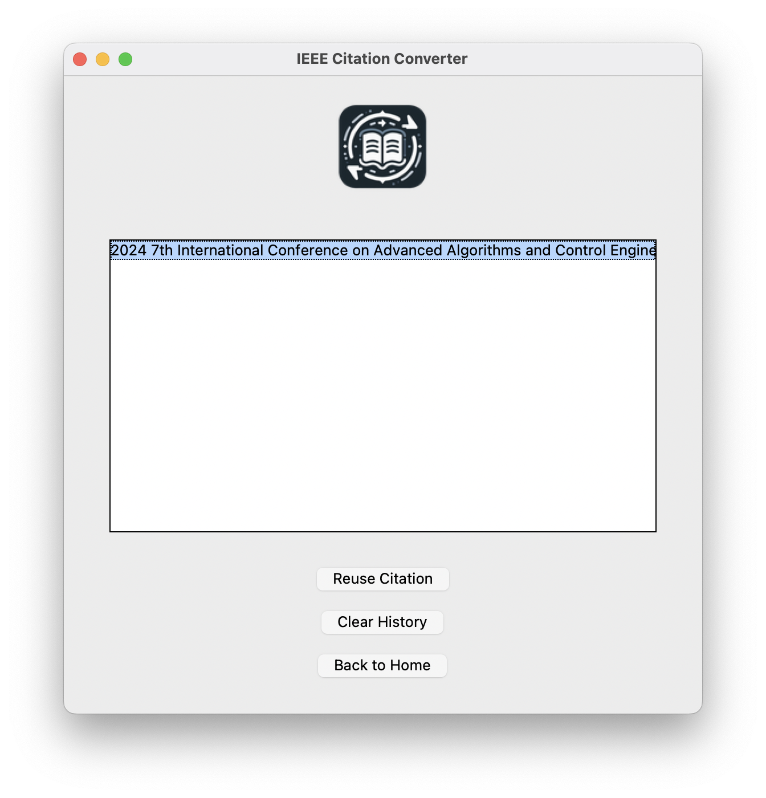

# Cite_Format_Converter

<p align="center">
  
</p>

## Overview

Converter is a Python-based application designed to help you convert citations and manage your citation history efficiently. The application provides a user-friendly interface for converting citations, viewing history, and reusing or clearing past citations.

## Features

- **Convert Citations**: Easily convert citations with a single click.
- **History Management**: View, reuse, and clear your citation history.
- **User-Friendly Interface**: Simple and intuitive UI for a seamless experience.

## Requirements

- Python 3.x
- Tkinter (usually included with Python)
- Any additional libraries specified in `requirements.txt`

## Installation

1. **Clone the repository**:
    ```sh
    git clone https://github.com/JJLi0427/converter.git
    cd converter
    ```

2. **Install dependencies**:
    ```sh
    pip install -r requirements.txt
    ```

## Usage

1. **Run the application**:
    ```sh
    python converter.py
    ```

2. **Convert Citations**:
    - Enter the citation details in the provided fields.
    - Click the "Convert" button to convert the citation.

3. **Manage History**:
    - Click the "History" button to view past citations.
    - Select a citation and click "Reuse Citation" to use it again.
    - Click "Clear History" to remove all past citations.
    - Click "Back" to return to the main screen.

## Screenshots

<p align="center">
  
  
</p>

## Contributing

Contributions are welcome! Please fork the repository and submit a pull request.

## License

This project is licensed under the MIT License. See the [LICENSE](LICENSE) file for details.

## Contact

For any questions or suggestions, please open an issue or contact me at <2366876022@qq.com>

## TODO

* -[] Pack it to be an application on MacOS and Windows